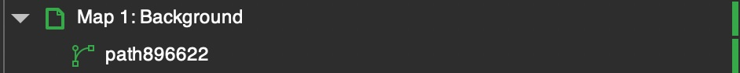
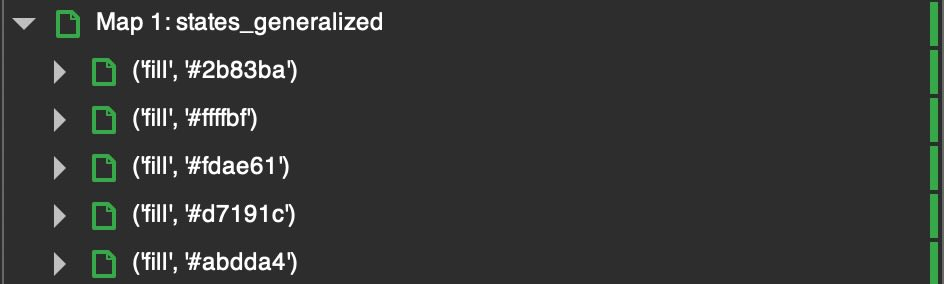
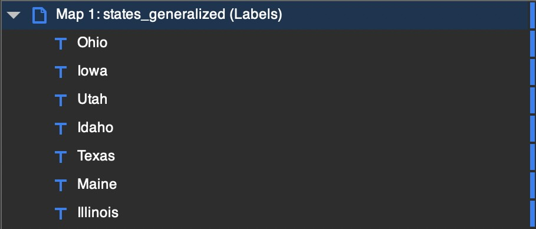
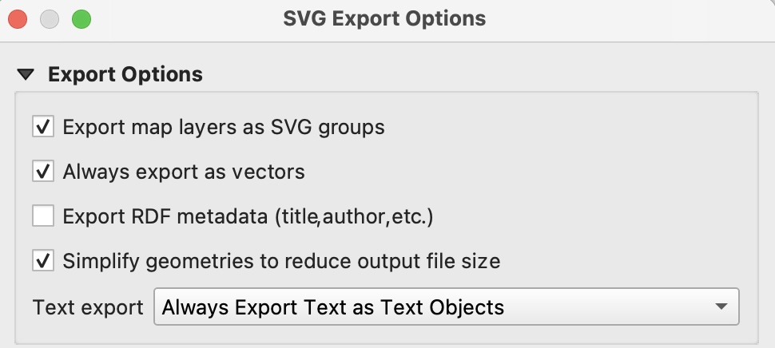

# QGIS2Inkscape
An Inkscape extension for formatting SVG exports from QGIS. Typically, SVG exports are filled with empty layers and ungrouped styles. This extension is designed to improve ease of use for QGIS to Inkscape workflows.

### Why QGIS + Inkscape?

For a fully free and open-source (FOSS) cartographic workflow! Unburden yourself from proprietary headaches—no more always-online desktop applications, expensive subscriptions, high compute requirements, or pesky proprietary formats (i.e. .AIX, yuck!). No more untimely crashes (just kidding! but at least you'll be crashing for free). Neither QGIS or Inkscape are perfect, but combined they enable the creation of professional quality cartography. 

* Want to learn QGIS? Check out the official [training manual](https://docs.qgis.org/3.44/en/docs/training_manual/index.html). Learning QGIS from scratch? Check out the [Gentle Introduction to QGIS](https://docs.qgis.org/3.44/en/docs/gentle_gis_introduction/index.html).
* Want to learn Inkscape? Check out the [official tutorials](https://inkscape.org/learn/tutorials/). There are also plenty of great how-to resources on YouTube. I hope to, at some point, produce a video walkthrough covering some basic cartographic practices in Inkscape.

### Why SVG?

Scalable Vector Graphics (SVG) is an open-source vector-graphics format developed by the World Wide Web Consortium (W3C). SVGs can be embedded natively into websites, or exported from Inkscape as images. Most importantly, since SVG is open-source, it can be used across vector-graphics editing software. While SVG is the native format for Inkscape, if you needed to (and I mean _really_ needed to) make further edits using Illustrator or Affinity Designer, you could!

### QGIS2Inkscape Features
When you run the extension on an SVG layout from QGIS, it will do the following:

__Delete__ empty layers

__Group__ features within a layer based on similar styles. The name of each resulting group will be the style unique to that group.

__Rename__ label layers in the layers panel with their text content.

### Installing
1. Download the [QGIS2Inkscape](QGIS2Inkscape.zip) library ZIP file, and unzip the QGIS2Inkscape folder.
2. Open Inkscape.
3. In Settings > System > User extensions, determine where Inkscape extensions are housed. Open that folder.
4. Copy the QGIS2Inkscape folder into the extensions folder.
5. Restart Inkscape.
6. The QGIS2Inkscape extension can now be found in Extensions > QGIS2Inkscape. YOU'RE READY!

### How to Use
1. Create a map in QGIS! 
2. Create a layout using your QGIS map.
3. Once your layout has been created, select "Export Map as SVG"
4. In the "SVG Export Options" window, select the following settings. 

5. Open the resulting SVG in Inkscape.
6. Select and run the QGIS2Inkscape extension!

### FAQ
__I have a raster layer, will that cause any problems?__
Nope! A raster image will export without issue.

__Where can I put my QGIS2Inkscape feature ideas?__
Create a "new issue" on Github! I'll get to it (eventually). If it's out of scope, I'll try to recommend alternatives.

 

***

### License

Copyright 2025 CartoBaldrica

This program is free software; you can redistribute it and/or modify it under the terms of the GNU General Public License as published by the Free Software Foundation; either version 2 of the License, or (at your option) any later version.

This program is distributed in the hope that it will be useful, but WITHOUT ANY WARRANTY; without even the implied warranty of MERCHANTABILITY or FITNESS FOR A PARTICULAR PURPOSE. See the GNU General Public License for more details.

You should have received a copy of the GNU General Public License along with this program; if not, write to the Free Software Foundation, Inc., 51 Franklin Street, Fifth Floor, Boston, MA  02110-1301, USA.